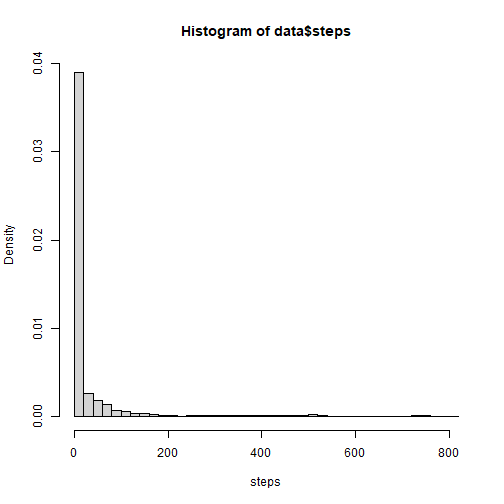
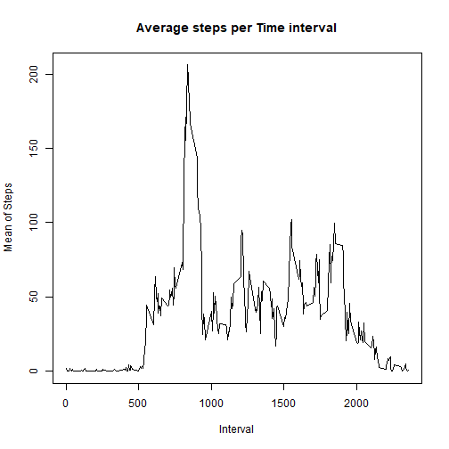
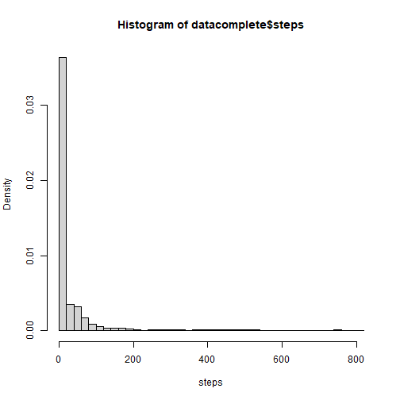
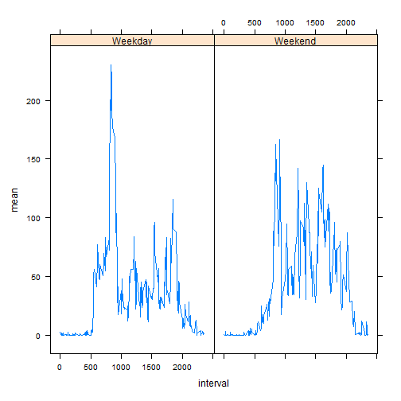

## Loading and preprocessing the data


```r
data <- read.csv("activity.csv")
```


## What is mean total number of steps taken per day?
median steps are 0
mean steps is 37.38


```r
hist(data$steps, freq=F, breaks = 50, xlab = "steps")
```



```r
median(data$steps, na.rm =T)
```

```
## [1] 0
```

```r
mean(data$steps, na.rm = T)
```

```
## [1] 37.3826
```


## What is the average daily activity pattern?
on average, this person sets the most steps in interval 835


```r
meanperday <- data %>% group_by(interval) %>% summarize(mean = mean(steps, na.rm = T), .groups = "keep") #calculating means per interval 
plot(meanperday$interval, meanperday$mean, type = "l", main = "Average steps per Time interval", 
     xlab = "Interval", ylab = "Mean of Steps") #plotting
```



```r
#finding interval person is most active
max <- max(meanperday$mean)
meanperday[meanperday$mean == max,1]
```


## Imputing missing values


```r
#calculating number of rows with NAs
nrow(data) - sum(complete.cases(data)) #2304
```

```
## [1] 2304
```

```r
#filling in NAs with mean for activity for that interval, and making new dataframe

datacomplete <- data
for (i in 1:nrow(datacomplete)) {
      if (is.na(datacomplete$steps[i]) ==T) {
            datacomplete$steps[i] = meanperday$mean[meanperday$interval == datacomplete$interval[i]]
      }
}

#recalculating mean, median and histogram
hist(datacomplete$steps, freq=F, breaks = 50, xlab = "steps") #densities have changed, shape not
```



```r
median(datacomplete$steps, na.rm =T) #was 0, is still 0
```

```
## [1] 0
```

```r
mean(datacomplete$steps, na.rm = T) #was 37.38, still 37.38
```

```
## [1] 37.3826
```


## Are there differences in activity patterns between weekdays and weekends?

```r
#making new variable factor for weekdays vs weekends
datacomplete$date <- as.Date(datacomplete$date, "%Y-%m-%d")
datacomplete$day <- as.factor(ifelse(weekdays(datacomplete$date)%in%c("maandag", "dinsdag", "woensdag", "donderdag", "vrijdag"), "Weekday", "Weekend"))

meanperweekday <- datacomplete %>% group_by(day, interval) %>% summarize(mean = mean(steps, na.rm = T), .groups = "keep")

#plott
library(lattice)
plot(interval, steps, data = subset(datacomplete, day = "Weekend"), main = "Steps in Weekend")
```

```
## Error in plot(interval, steps, data = subset(datacomplete, day = "Weekend"), : object 'interval' not found
```

```r
xyplot(mean ~ interval | day, data = meanperweekday, type = "l")
```



```r
knit2html()
```

```
## Error in read_utf8(input): argument "input" is missing, with no default
```

